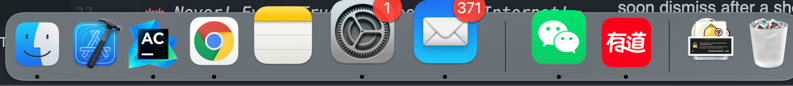
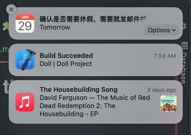
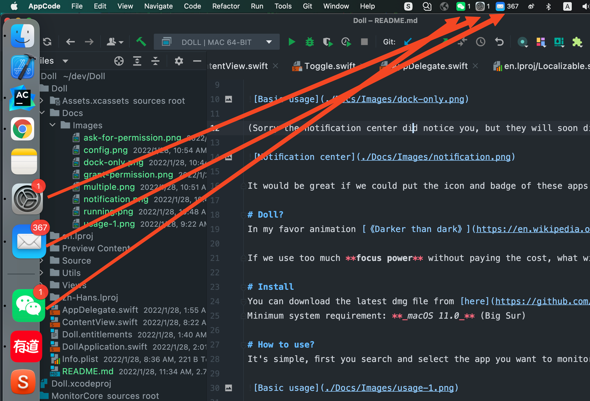
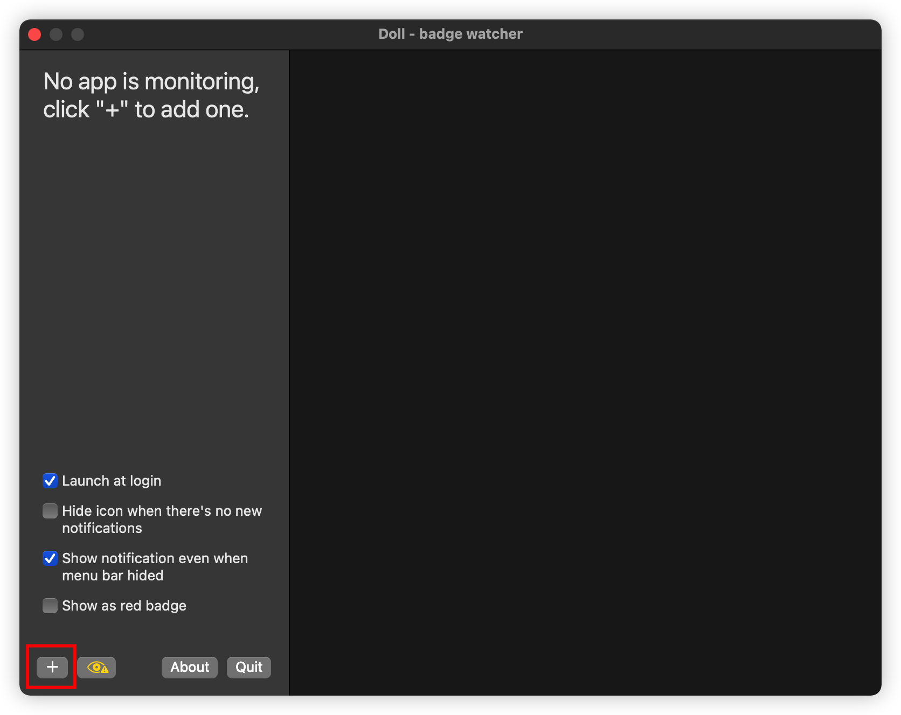
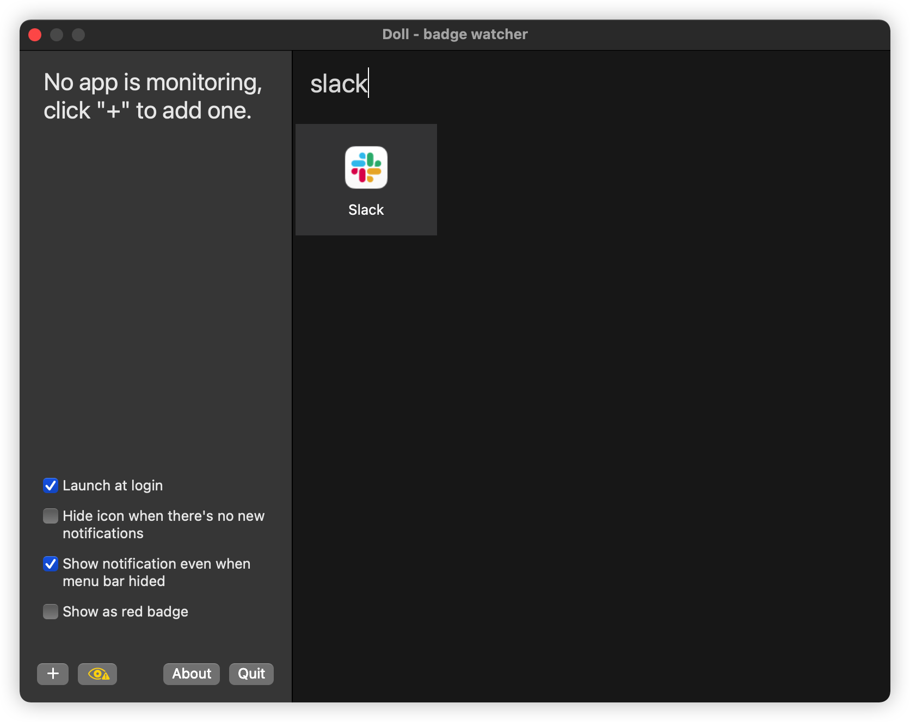
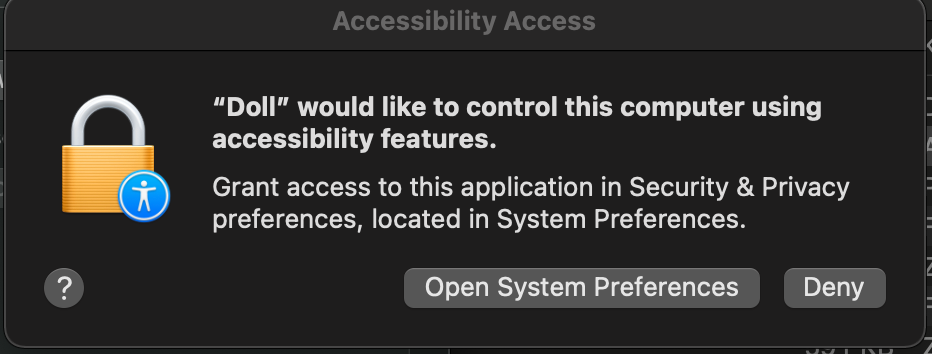
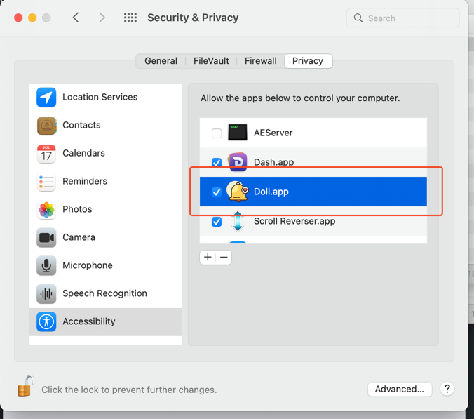
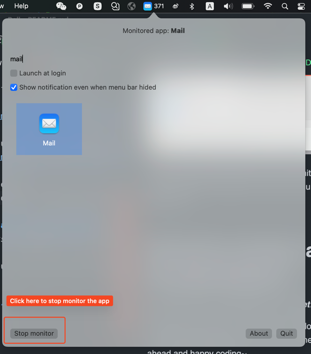
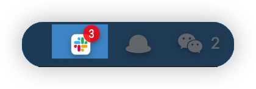
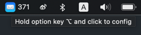

# Doll is a Mac app that help you catch up important messages!

In **macOS**, It feels really great when you hide the **Dock**, open a **full screen** window and focus on your task.

But we are not living in an ideal world, your teammates may need your help anytime, and when you are in focus mode, occasionally you just _**forgot to respond**_!

Message apps like **Mail**, **Slack** and **Microsoft Teams** don't even offer a **_menu bar icon_** at all, so if you're working in a full screen window, or looking at another extra Monitor screen which can't show the Dock, there is no way you will notice the unread messages!

 
(Sorry the notification center did notice you, but they will soon dismiss after a short period, if you miss that, you miss the message)

It would be great if we could put the icon and badge of these apps into the **_Menu bar_**, that way we can always easily notice new messages across screens, just like this:

# Doll?
In my favor animation [《Darker than dark》](https://en.wikipedia.org/wiki/Darker_than_Black), if a **_Contractor_** use his power and never willing to pay the cost, eventually he will lose control of his power, become an emotionless **_Doll_**.

If we use too much **focus power** without paying the cost, what will we become >>__<<.

# Install
You can download the latest dmg file from [here](https://github.com/xiaogdgenuine/Doll/releases/latest)
Minimum system requirement: **_macOS 11.0_** (Big Sur)

# How to use?
It's simple, click on "+" button at the left bottom corner, search and select the app you want to monitor:

Then Doll will ask for your permission to use the Accessibility API: 

Please make sure you grant that permission to **Doll.app** otherwise nothing will be monitored!

Done, you are all setup!
Doll now will monitor all the badge update in the Dock, and sync the numbers into the menu bar!

Doll also can show new notification as red badge, just like in dock!

# I want to change the Monitor apps
If the monitored app is running, click on the menu bar icon will simply open that app.

But if you want to change stuffs, use right click, or left click while holding the "**_Option key(⌥)_**".

# Security concern about the permission?
**_Never! Ever! Trust! Anybody! in Internet!_**

**Doll** is open source, you are free to download, review, modify and compile your own version of the app, go ahead and happy coding~

# How the app works?
**Doll** utils the [macOS Accessibility API](https://developer.apple.com/library/archive/documentation/Accessibility/Conceptual/AccessibilityMacOSX/OSXAXmodel.html#//apple_ref/doc/uid/TP40001078-CH208-TPXREF101), it will sync the latest badge text to menu bar from every Monitored app in the **Dock** element.

Due to the limitation of Accessibility API(Can't watch for element's attribute value change), Doll has to sync badges by every second(Yep, the infamy **_Polling_** style).

But don't worry about the performance, after all the synchronization happens only 864000 times per day, and all it does is just read and set few element's text, that's an operation executed less than **1ms**!

If you found any potential Bug or Performance issue, feel free to submit a PR!

# Love this app?

